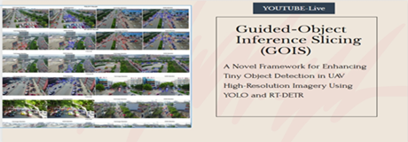

# Tiny Object Dectection-Benchmarks-Full-Image Detection for Inference  Vs Innovative Framework Guided Object Inference Slicing(GOIS) detection results 
BY MUZAMMUL(ZJU)
# Enhancing Tiny Object Detection by apply GOIS on Latest YOLO Models and RT-DETR Transformer, The innovative framework proved its significance both for Fine-Tuned and Not Fined-Tuned Models
Here is a demonstration video for the project:

(https://youtu.be/T5t5eb_w0S4)

# Section 1: Without Fine Tuning 15% Dataset Subset(970 Images) Inference Results VisDrone2019Train Dataset

## Comparative Results for FI-Det and GOIS-Det
This table presents the Average Precision (AP) and Average Recall (AR) metrics for seven models. Each model includes rows for FI-Det, GOIS-Det, and the percentage improvement achieved by GOIS over FI-Det. Downloadable links for FI-Det and GOIS-Det results are included.

| **Model** | **Download Links**              | **mAP@0.50:0.95** | **mAP@0.50** | **mAP@0.75** | **mAP-Small** | **mAP-Medium** | **mAP-Large** | **AR@1** | **AR@10** | **AR@100** | **AR-Small** | **AR-Medium** | **AR-Large** | **F1 Score** |
|-----------|---------------------------------|-------------------|--------------|--------------|---------------|----------------|---------------|----------|-----------|------------|--------------|---------------|--------------|--------------|
| YOLO11    | [FI-Det](https://github.com/MMUZAMMUL/Small-Object-Detection-Benchmarks-Full_ImageVsGOIS/releases/download/yolo11/FI_yolo11n.json), [GOIS-Det](https://github.com/MMUZAMMUL/Small-Object-Detection-Benchmarks-Full_ImageVsGOIS/releases/download/GOIS-YOLO11/GOIS_yolo11n.json) | 0.12 / 0.33   | 0.18 / 0.51   | 0.13 / 0.34   | 0.02 / 0.10    | 0.23 / 0.57     | 0.57 / 0.96     | 0.12 / 0.27  | 0.27 / 0.68   | 0.29 / 0.87   | 0.04 / 0.33    | 0.49 / 1.40     | 1.09 / 1.93     | 0.17 / 0.47  |
|           |                                 | **↑ 175.0%**      | **↑ 183.33%** | **↑ 161.54%** | **↑ 400.0%**   | **↑ 147.83%**  | **↑ 68.42%**  | **↑ 125.0%**  | **↑ 151.85%**  | **↑ 200.0%**  | **↑ 725.0%**   | **↑ 185.71%**  | **↑ 77.06%**  | **↑ 176.47%** |
| RT-DETR-L | [FI-Det](https://github.com/MMUZAMMUL/Small-Object-Detection-Benchmarks-Full_ImageVsGOIS/releases/download/RT-DETRv1/FI_rtder-l.json), [GOIS-Det](https://github.com/MMUZAMMUL/Small-Object-Detection-Benchmarks-Full_ImageVsGOIS/releases/download/GOIS-RT/GOIS_rtdetr-l.json) | 0.43 / 0.61   | 0.67 / 0.94   | 0.44 / 0.63   | 0.11 / 0.22    | 0.67 / 0.95     | 1.34 / 1.49     | 0.32 / 0.46  | 0.81 / 1.16   | 1.01 / 1.71   | 0.44 / 1.03    | 1.44 / 2.25     | 2.45 / 2.73     | 0.61 / 0.90  |
|           |                                 | **↑ 41.86%**      | **↑ 40.3%**   | **↑ 43.18%**  | **↑ 100.0%**   | **↑ 41.79%**   | **↑ 11.19%**  | **↑ 43.75%**  | **↑ 43.21%**   | **↑ 69.31%**  | **↑ 134.09%**  | **↑ 56.25%**   | **↑ 11.43%**  | **↑ 47.54%**  |
| YOLOv10   | [FI-Det](https://github.com/MMUZAMMUL/Small-Object-Detection-Benchmarks-Full_ImageVsGOIS/releases/download/yolov10-v1/FI_yolov10n.json), [GOIS-Det](https://github.com/MMUZAMMUL/Small-Object-Detection-Benchmarks-Full_ImageVsGOIS/releases/download/GOIS-Yolo10/GOIS_yolov10n.json) | 0.12 / 0.31   | 0.17 / 0.48   | 0.13 / 0.33   | 0.02 / 0.08    | 0.18 / 0.56     | 0.63 / 0.93     | 0.13 / 0.26  | 0.25 / 0.61   | 0.27 / 0.76   | 0.02 / 0.27    | 0.38 / 1.25     | 1.18 / 1.85     | 0.17 / 0.44  |
|           |                                 | **↑ 158.33%**     | **↑ 182.35%** | **↑ 153.85%** | **↑ 300.0%**   | **↑ 211.11%**  | **↑ 47.62%**  | **↑ 100.0%**  | **↑ 144.0%**   | **↑ 181.48%** | **↑ 1250.0%**  | **↑ 228.95%**  | **↑ 56.78%**  | **↑ 158.82%** |
| YOLOv9    | [FI-Det](https://github.com/MMUZAMMUL/Small-Object-Detection-Benchmarks-Full_ImageVsGOIS/releases/download/Yolov9-v1/FI_YOLOv9c.json), [GOIS-Det](https://github.com/MMUZAMMUL/Small-Object-Detection-Benchmarks-Full_ImageVsGOIS/releases/download/GOIS-YOLO9/GOIS_YOLOv9c.json) | 0.41 / 0.53   | 0.56 / 0.76   | 0.45 / 0.58   | 0.06 / 0.18    | 0.72 / 0.90     | 1.33 / 1.18     | 0.30 / 0.40  | 0.65 / 0.91   | 0.73 / 1.16   | 0.17 / 0.53    | 1.20 / 1.79     | 2.22 / 2.21     | 0.52 / 0.73  |
|           |                                 | **↑ 29.27%**      | **↑ 35.71%**  | **↑ 28.89%**  | **↑ 200.0%**   | **↑ 25.0%**    | **↓ 11.28%** | **↑ 33.33%** | **↑ 40.0%**   | **↑ 58.9%**   | **↑ 211.76%**  | **↑ 49.17%**   | **↓ 0.45%**   | **↑ 40.38%**  |
| YOLOv8n   | [FI-Det](https://github.com/MMUZAMMUL/Small-Object-Detection-Benchmarks-Full_ImageVsGOIS/releases/download/Yolov8-v1/FI_yolov8n.json), [GOIS-Det](https://github.com/MMUZAMMUL/Small-Object-Detection-Benchmarks-Full_ImageVsGOIS/releases/download/GOIS-YOLO8/GOIS_yolov8n.json) | 0.14 / 0.30   | 0.20 / 0.47   | 0.14 / 0.32   | 0.03 / 0.13    | 0.24 / 0.53     | 0.54 / 0.97     | 0.15 / 0.28  | 0.29 / 0.67   | 0.32 / 0.84   | 0.04 / 0.39    | 0.50 / 1.34     | 1.22 / 1.93     | 0.19 / 0.44  |
|           |                                 | **↑ 114.29%**     | **↑ 135.0%**  | **↑ 128.57%** | **↑ 333.33%**  | **↑ 120.83%**  | **↑ 79.63%** | **↑ 86.67%** | **↑ 131.03%** | **↑ 162.5%**  | **↑ 875.0%**   | **↑ 168.0%**   | **↑ 58.2%**   | **↑ 131.58%** |
| YOLOv5n   | [FI-Det](https://github.com/MMUZAMMUL/Small-Object-Detection-Benchmarks-Full_ImageVsGOIS/releases/download/Yolov5-v1/FI_yolov5su.json), [GOIS-Det](https://github.com/MMUZAMMUL/Small-Object-Detection-Benchmarks-Full_ImageVsGOIS/releases/download/GOIS-YOLO5/GOIS_yolov5su.json) | 0.18 / 0.38   | 0.27 / 0.58   | 0.19 / 0.41   | 0.03 / 0.16    | 0.32 / 0.65     | 0.79 / 1.02     | 0.16 / 0.29  | 0.36 / 0.71   | 0.41 / 0.93   | 0.10 / 0.51    | 0.67 / 1.44     | 1.51 / 1.93     | 0.25 / 0.54  |
|           |                                 | **↑ 111.11%**     | **↑ 114.81%** | **↑ 115.79%** | **↑ 433.33%**  | **↑ 103.12%**  | **↑ 29.11%** | **↑ 81.25%** | **↑ 97.22%**  | **↑ 126.83%** | **↑ 410.0%**   | **↑ 114.93%**  | **↑ 27.81%**  | **↑ 116.0%**  |
| YOLOv8s-WorldV2   | [FI-Det](https://github.com/MMUZAMMUL/Small-Object-Detection-Benchmarks-Full_ImageVsGOIS/releases/download/yolo8world-v1/FI_yolov8s-worldv2.json), [GOIS-Det](https://github.com/MMUZAMMUL/Small-Object-Detection-Benchmarks-Full_ImageVsGOIS/releases/download/GOIS-YOLOWORLD/GOIS_yolov8s-worldv2.json) | 0.23 / 0.40   | 0.34 / 0.60   | 0.23 / 0.43   | 0.04 / 0.16    | 0.42 / 0.68     | 0.90 / 1.01     | 0.21 / 0.36  | 0.42 / 0.84   | 0.46 / 1.03   | 0.11 / 0.48    | 0.75 / 1.59     | 1.79 / 1.97     | 0.30 / 0.58  |

# Section 2: Fine Tuning Models with 10 epoches Visdrone Traning and then Inference results  on  Full Dataset(6,471 Images) VisDrone2019Train 

## Comparative Results for FI-Det and GOIS-Det
This table presents the Average Precision (AP) and Average Recall (AR) metrics for five models (YOLO11, YOLOv10, YOLOv9, YOLOv8, YOLOv5). Each model includes three rows: FI-Det results, GOIS-Det results, and % improvement achieved by GOIS. Downloadable links for FI-Det and GOIS-Det results are included in the first column next to the model name. Ground Truth COCO for this evaluation available at | [FullTraineDatasetGT](https://github.com/MMUZAMMUL/TinyObjectDetectionGOIS-Benchmarks/releases/download/Full-VisdroneTrain-COCO-GT/ground_truth_coco.json)

| **Model** | **FI-Det File** | **GOIS-Det File** | **AP@[IoU=0.50:0.95]** | **AP@[IoU=0.50]** | **AP@[IoU=0.75]** | **AP-Small** | **AP-Medium** | **AP-Large** | **AR@1** | **AR@10** | **AR@100** | **AR-Small** | **AR-Medium** | **AR-Large** | **F1 Score** |
|-----------|-----------------|-------------------|-------------------------|-------------------|-------------------|--------------|---------------|--------------|----------|-----------|------------|--------------|---------------|--------------|--------------|
| YOLO11    | [Download](https://github.com/MMUZAMMUL/TinyObjectDetectionGOIS-Benchmarks/releases/download/FT-YOLOv11-FI/Yolo11n_predictions_coco.json)   | [Download](https://github.com/MMUZAMMUL/TinyObjectDetectionGOIS-Benchmarks/releases/download/FT-YOLOv11-GOIS/Yolo11n-gois_predictions_coco.json)    | 0.12                   | 0.171            | 0.119            | 0.024        | 0.159         | 0.283        | 0.045    | 0.112     | 0.137      | 0.035        | 0.208         | 0.349        | 0.17         |
|           |                 |                   | 0.123                  | 0.193            | 0.132            | 0.072        | 0.164         | 0.151        | 0.054    | 0.152     | 0.208      | 0.132        | 0.274         | 0.227        | 0.47         |
|           |                 |                   | ↑ 12.01%               | ↑ 12.38%         | ↑ 11.26%         | ↑ 196.90%    | ↑ 2.94%       | ↓ 46.71%     | ↑ 18.81% | ↑ 35.46%  | ↑ 51.17%   | ↑ 278.66%    | ↑ 31.44%      | ↓ 34.90%     | ↑ 176.47%    |
| YOLOv10   | [Download](https://github.com/MMUZAMMUL/TinyObjectDetectionGOIS-Benchmarks/releases/download/FT-YOLOv10-FI/Yolo10-full_predictions_coco.json)   | [Download](https://github.com/MMUZAMMUL/TinyObjectDetectionGOIS-Benchmarks/releases/download/FT-YOLOv10-GOIS/Yolo10-gois_predictions_coco.json)    | 0.091                  | 0.140            | 0.100            | 0.022        | 0.133         | 0.222        | 0.041    | 0.097     | 0.117      | 0.029        | 0.178         | 0.278        | 0.17         |
|           |                 |                   | 0.099                  | 0.156            | 0.107            | 0.061        | 0.130         | 0.100        | 0.047    | 0.127     | 0.172      | 0.109        | 0.219         | 0.159        | 0.44         |
|           |                 |                   | ↑ 8.88%                | ↑ 11.40%         | ↑ 7.08%          | ↑ 176.54%    | ↓ 2.30%       | ↓ 54.85%     | ↑ 14.18% | ↑ 31.01%  | ↑ 46.09%   | ↑ 279.22%    | ↑ 22.50%      | ↓ 42.82%     | ↑ 158.82%    |
| YOLOv9    | [Download](https://github.com/MMUZAMMUL/TinyObjectDetectionGOIS-Benchmarks/releases/download/FT-YOLOv9-FI/Yolo9-full_predictions_coco.json)   | [Download](https://github.com/MMUZAMMUL/TinyObjectDetectionGOIS-Benchmarks/releases/download/FT-YOLOv9-GOIS/Yolo9-gois_predictions_coco.json)    | 0.212                  | 0.322            | 0.232            | 0.079        | 0.320         | 0.472        | 0.080    | 0.211     | 0.252      | 0.103        | 0.387         | 0.551        | 0.17         |
|           |                 |                   | 0.187                  | 0.295            | 0.199            | 0.130        | 0.242         | 0.171        | 0.079    | 0.231     | 0.310      | 0.234        | 0.396         | 0.239        | 0.44         |
|           |                 |                   | ↓ 11.93%               | ↓ 8.15%          | ↓ 14.10%         | ↑ 64.98%     | ↓ 24.20%      | ↓ 63.83%     | ↓ 1.07%  | ↑ 9.85%   | ↑ 22.94%   | ↑ 127.93%    | ↑ 2.38%       | ↓ 56.64%     | ↑ 158.82%    |
| YOLOv8    | [Download](https://github.com/MMUZAMMUL/TinyObjectDetectionGOIS-Benchmarks/releases/download/FT-YOLOv8-FI/Yolo8-full_predictions_coco.json)   | [Download](https://github.com/MMUZAMMUL/TinyObjectDetectionGOIS-Benchmarks/releases/download/FT-YOLOv8-GOIS/Yolo8-gois_predictions_coco.json)    | 0.108                  | 0.168            | 0.118            | 0.025        | 0.158         | 0.290        | 0.046    | 0.113     | 0.136      | 0.032        | 0.209         | 0.365        | 0.17         |
|           |                 |                   | 0.121                  | 0.193            | 0.130            | 0.070        | 0.163         | 0.149        | 0.056    | 0.158     | 0.211      | 0.131        | 0.281         | 0.220        | 0.47         |
|           |                 |                   | ↑ 11.82%               | ↑ 14.46%         | ↑ 10.03%         | ↑ 178.14%    | ↑ 3.22%       | ↓ 48.67%     | ↑ 22.33% | ↑ 40.05%  | ↑ 55.92%   | ↑ 308.02%    | ↑ 34.65%      | ↓ 39.72%     | ↑ 176.47%    |
| YOLOv5    | [Download](https://github.com/MMUZAMMUL/TinyObjectDetectionGOIS-Benchmarks/releases/download/FT-Yolov5-FI/Yolo5-full_predictions_coco.json)   | [Download](https://github.com/MMUZAMMUL/TinyObjectDetectionGOIS-Benchmarks/releases/download/FT-Yolov5-GOIS/Yolo5-gois_predictions_coco.json)    | 0.096                  | 0.150            | 0.104            | 0.019        | 0.138         | 0.270        | 0.040    | 0.098     | 0.119      | 0.026        | 0.181         | 0.329        | 0.17         |
|           |                 |                   | 0.109                  | 0.174            | 0.116            | 0.059        | 0.150         | 0.134        | 0.050    | 0.139     | 0.188      | 0.111        | 0.254         | 0.205        | 0.54         |
|           |                 |                   | ↑ 13.61%               | ↑ 16.09%         | ↑ 11.36%         | ↑ 209.43%    | ↑ 9.07%       | ↓ 50.16%     | ↑ 26.22% | ↑ 42.71%  | ↑ 58.12%   | ↑ 329.90%    | ↑ 40.05%      | ↓ 37.62%     | ↑ 216.47%    |

**Notes:**
- ↑ represents percentage improvement achieved by GOIS-Det over FI-Det.
- ↓ represents performance degradation in GOIS-Det compared to FI-Det.
- Replace `#` in `Download` links with the actual URLs for downloadable files.
